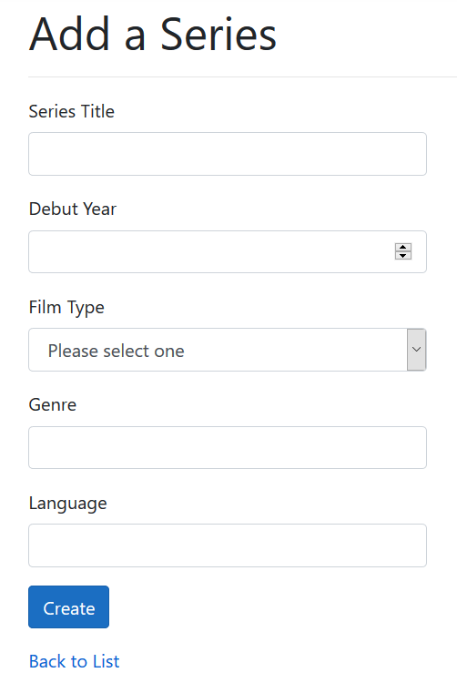
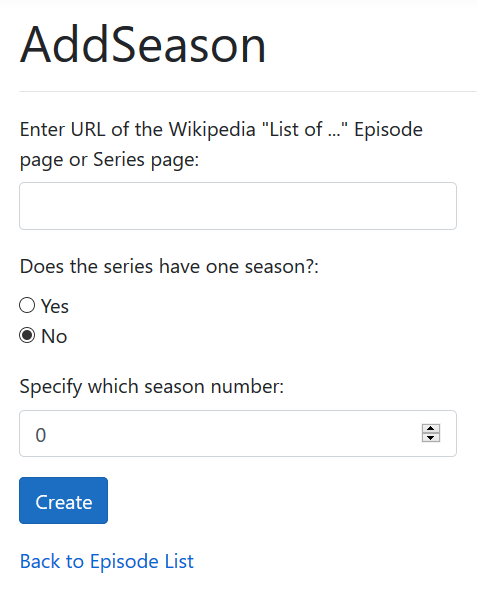

# Series Tracker User Manual
The Series Tracker gets it data from Wikipedia (Powered by WikiData). As of this current version, it can only add individual series and individual seasons and its episodes and selected details.

The Series Tracker aims to be a CRUD application aided by the use of Wikipedia's RESTful API services to supply and collect data.

## Video Demo

* [Adding *Friends* Season 1.](https://streamable.com/dhm6bg)
* [Adding *My Hero Academia* Season 1 and 2.](https://streamable.com/o1to2n)

## Sections
* [Admin Roles](#admin-roles)
  * [Adding a New Series](#adding-a-new-series)
  * [Adding a New Season](#adding-a-new-season)

## Admin Roles
The following operations are meant for admin or manager level roles. These affect the database and organisation of the data directly.
### Adding a New Series

Adding a new series is as simple as just filling in the form.

There are several validation conditions:
* Series title must be entered.
* Valid debut year is between 1920 and the current year.
* There are only three film types to choose from.

### Adding a New Season

Adding a season is done within the page of the series. An `Add new season` link is available in the series page where it lists the season and episodes.

The URL to be entered requires a certain Wikipedia page. The Wikipedia page can either be the series's "List of ... " episode page or the series page itself.

In most cases, you can simply search Wikipedia with `"List of <name of series> episodes"`.
* If the series only has one season, click the `No` radio button.
* If the series has more than one season, click the `Yes` radio button and specify which season number you would like to collect.

For example:
* My Hero Academia has a "List of ... " episode page with multiple seasons.
  * The URL is: `https://en.wikipedia.org/wiki/List_of_My_Hero_Academia_episodes`
* Demon Slayer has a "List of ... " episode page but only has one season, this is still valid:
  * The URL is: `https://en.wikipedia.org/wiki/List_of_Demon_Slayer:_Kimetsu_no_Yaiba_episodes`
* Zoey's Extraordinary Playlist has no "List of ... " episode page because it only has one season (as of July, 2020). The URL is still valid.
  * The series page URL is: `https://en.wikipedia.org/wiki/Zoey%27s_Extraordinary_Playlist`
